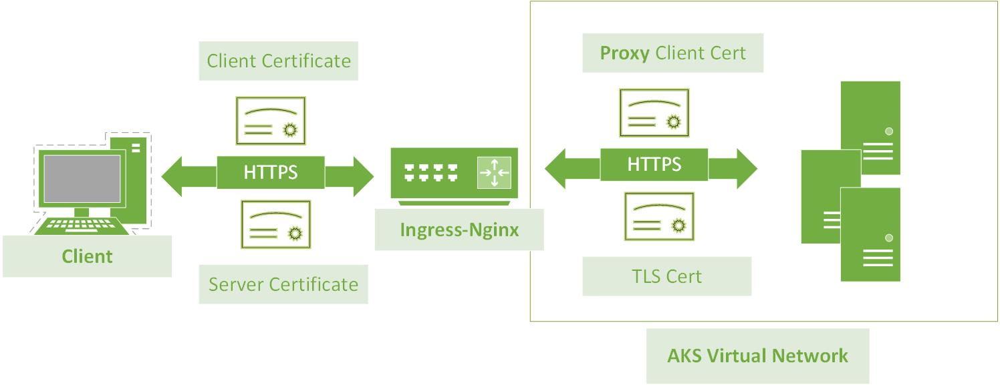

# End-to-End TLS with Ingress Controller and OSM
* TOC
{:toc}

## Background
Now we have our [demo application](https://lissff.github.io/osm-tls-part1/) running perfectly on HTTPS.
Let's explore the End-to-End TLS with ingress nginx and OSM(for security-critical services and multi-tenant environment
):

There are multiple certificates involved here:  
* Client Certificate: (optional) for your local machine or devices
* Server Certificate: Certificate that could prove the identity of my server **osm-tls.canadacentral.cloudapp.azure.com**, which was generated by cert-manager in our [demo application](https://lissff.github.io/osm-tls-part1/)
  
* Proxy Client Certificate: Ingress-nginx as proxy also need a certificate to establish mTLS with backend pods
* (Pod) Upstream TLS cert: managed by envoy

## Issue Certificate for Ingress-nginx
Ingress-nginx who now works as proxy who also need to authenticate itself to upstream server, and we will ask OSM to generate a certificate for him. Why? We need the proxy certificate and (Pod) Upstream TLS certificate issued by the same root CA, so that they can trust each other.
### Issue Certificate for Proxy
Adding below block in the meshconfig, e.g.  
`kubectl edit meshconfig osm-mesh-config -n kube-config`

```
certificate:
  ingressGateway:
    secret:
      name: osm-nginx-client-cert
      namespace: kube-system
    subjectAltNames:
    - ingress-nginx.ingress-basic.cluster.local
    validityDuration: 24h
```

A secret named **osm-nginx-client-cert** will be generated in the kubs-system namespace signed by root CA **osm-ca.openservicemesh.io**.
You can inspect the certificate by   
`kubectl get secret osm-nginx-client-cert -n kube-system  -o "jsonpath={.data['tls\.crt']}" |base64 -d|openssl x509 -noout -text`

Notice the issuer CN and server CN:

**Issuer: C = US, L = CA, O = Open Service Mesh, CN = osm-ca.openservicemesh.io**  
**Subject: O = Open Service Mesh, CN = ingress-nginx.ingress-basic.cluster.local**
```
Certificate:
    Data:
        Version: 3 (0x2)
        Serial Number:
            bc:26:26:d5:bd:89:82:c1:64:c5:69:c1:85:44:db:1f
        Signature Algorithm: sha256WithRSAEncryption
        Issuer: C = US, L = CA, O = Open Service Mesh, CN = osm-ca.openservicemesh.io
        Validity
            Not Before: Apr 18 05:22:24 2022 GMT
            Not After : Apr 19 05:22:24 2022 GMT
        Subject: O = Open Service Mesh, CN = ingress-nginx.ingress-basic.cluster.local
        Subject Public Key Info:
            Public Key Algorithm: rsaEncryption
...
```
### Configure Ingress Rule
Few more annotations added to our Ingress Rule since our demo app:

| Annotation  |Value   |  Comment |  
|---|---|---|
|  nginx.ingress.kubernetes.io/proxy-ssl-secret |kube-system/osm-nginx-proxy-cert|   Nginx will use this proxy cert to communicate with upstream server|   
| nginx.ingress.kubernetes.io/backend-protocol  |  HTTPS |end-to-end TLS |  
|nginx.ingress.kubernetes.io/proxy-ssl-verify| on | Optional |
| nginx.ingress.kubernetes.io/configuration-snippet:\|proxy_ssl_name  |default.osm.cluster.local | Optional, only needed if proxy-ssl-verify is on; it is the default Upstream service SAN if you didn't specify your own serviceAccount. A misconfig will causing error: **upstream SSL certificate does not match "upstream_balancer" while SSL handshaking to upstream**|

```
apiVersion: networking.k8s.io/v1
kind: Ingress
metadata:
  annotations:
    cert-manager.io/cluster-issuer: letsencrypt
    nginx.ingress.kubernetes.io/backend-protocol: HTTPS
    nginx.ingress.kubernetes.io/configuration-snippet: |
      proxy_ssl_name "default.osm.cluster.local";
    nginx.ingress.kubernetes.io/proxy-ssl-secret: kube-system/osm-nginx-proxy-cert
    nginx.ingress.kubernetes.io/proxy-ssl-verify: "on"
    nginx.ingress.kubernetes.io/rewrite-target: /$2
    nginx.ingress.kubernetes.io/use-regex: "true"
  name: test-ingress
  namespace: osm
spec:
  ingressClassName: nginx
  rules:
  - host: osm-tls.canadacentral.cloudapp.azure.com
    http:
      paths:
      - backend:
          service:
            name: whoami
            port:
              number: 80
        path: /whoami(/|$)(.*)
        pathType: Prefix
  tls:
  - hosts:
    - osm-tls.canadacentral.cloudapp.azure.com
    secretName: ingress-tls
```

### Configure IngressBackend
Here are some extra annotations added to our Ingress Rule:  
**spec.backend.port.protocol: https** (Please tolerate my laziness of using port 80 for https)
Without this https as protocol you will see errors in ingress-controller pod:
```
 [error] 174#174: *29644 SSL_do_handshake() failed (SSL: error:14094410:SSL routines:ssl3_read_bytes:sslv3 alert handshake failure:SSL alert number 40) while SSL handshaking to upstream,
```
**AuthenticatedPrincipal**, it is optional, and no need to specify if you are not sure about it.    
If you misconfigured the SAN to something else, there will be **403 RBAC: access denied** error waiting for you. 
```
apiVersion: policy.openservicemesh.io/v1alpha1
kind: IngressBackend
metadata:
  annotations:
  name: whoami
  namespace: osm
spec:
  backends:
  - name: whoami
    port:
      number: 80
      protocol: https
  sources:
  - kind: Service
    name: ingress-nginx-controller
    namespace: ingress-basic
  - kind: AuthenticatedPrincipal
    name: ingress-nginx.ingress-basic.cluster.local
```
Well Done!!
